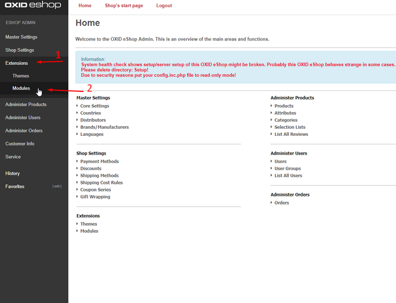
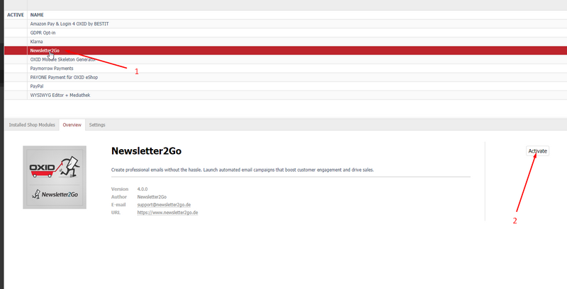
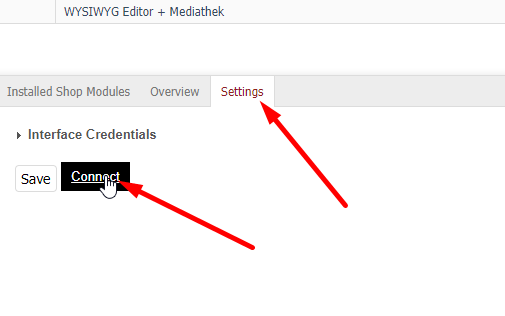
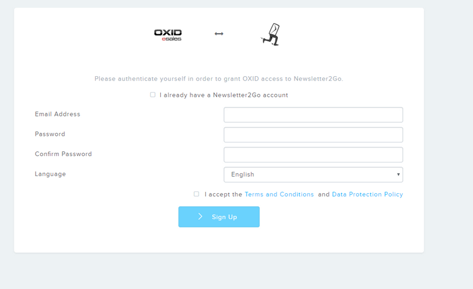

# newsletter2go-oxid6-module

Connect your Newsletter2Go account to your Oxid6 webshop. Transfer customers or easily add products from your shop to newsletters.

## Installation
1. Copy the content of this project into `<shop_directory>/source/modules/newsletter2go` directory

For example using git:

    git clone https://github.com/newsletter2go/newsletter2go-oxid6-module.git <shop_directory>/source/modules/newsletter2go

2. Add new namespace to shop composer.json

```
  "autoload": {
    "psr-4": {
      "Newsletter2Go\\Newsletter2Go\\": "./source/modules/newsletter2go"
    }
  }
```

3. Update composer autoloader in `<shop_directory>`
```
  composer dump-autoload
```

4. Navigate in admin control panel to Extensions > Module and search for Newsletter2Go




5. Activate the Module



6. Navigate in the Submenu of the Module to Settings and click on connect button



7. Authenticate Oxid accessing Newsletter2Go



## License
    This program is free software: you can redistribute it and/or modify
    it under the terms of the GNU General Public License as published by
    the Free Software Foundation, either version 3 of the License, or
    (at your option) any later version.

    This program is distributed in the hope that it will be useful,
    but WITHOUT ANY WARRANTY; without even the implied warranty of
    MERCHANTABILITY or FITNESS FOR A PARTICULAR PURPOSE.  See the
    GNU General Public License for more details.

    You should have received a copy of the GNU General Public License
    along with this program.  If not, see <http://www.gnu.org/licenses/>.


## Copyright
https://www.newsletter2go.de
